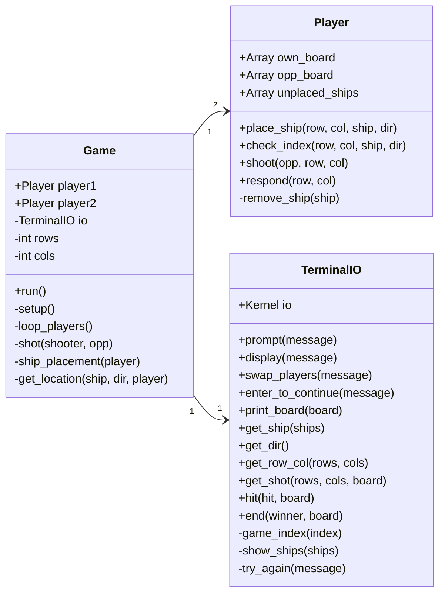

```mermaid
   classDiagram
   direction LR
   Game "1" --> "2" Player
   Game "1" --> "1" TerminalIO
   class Game{
   +Player player1
   +Player player2
   -TerminalIO io
   -int rows
   -int cols
   +run()
   -setup()
   -loop_players()
   -shot(shooter, opp) 
   -ship_placement(player)
   -get_location(ship, dir, player)
   }
   class Player {
   +Array own_board
   +Array opp_board
   +Array unplaced_ships
   +place_ship(row, col, ship, dir)
   +check_index(row, col, ship, dir)
   +shoot(opp, row, col)
   +respond(row, col)
   -remove_ship(ship)
   }
   class TerminalIO{
   +Kernel io
   +prompt(message)
   +display(message)
   +swap_players(message)
   +enter_to_continue(message)
   +print_board(board)
   +get_ship(ships)
   +get_dir()
   +get_row_col(rows, cols)
   +get_shot(rows, cols, board)
   +hit(hit, board)
   +end(winner, board)
   -game_index(index)
   -show_ships(ships)
   -try_again(message)
   }
```
             
