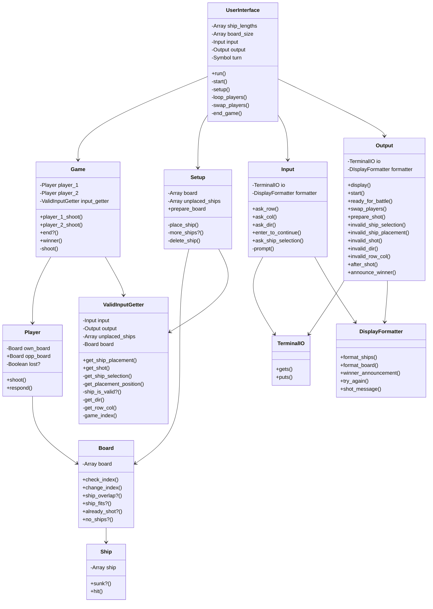

```mermaid
   classDiagram
   Board --> Ship
   Setup --> Board
   Setup --> ValidInputGetter
   Player --> Board
   Game --> Player
   Game --> ValidInputGetter
   UserInterface --> Game
   User Interface --> Setup
   UserInterface --> Input
   UserInterface --> Output
   Input --> TerminalIO
   Input --> DisplayFormatter
   Output --> TerminalIO
   Output --> DisplayFormatter
   
   class Ship{
      -Array ship
      +sunk?()
      +hit()
   }

   class Board {
      -Array board
      +check_index()
      +change_index()
      +ship_overlap?()
      +ship_fits?()
      +already_shot?()
      +no_ships?()
   }

   class Player {
      -Board own_board
      +Board opp_board
      -Boolean lost?
      +shoot()
      +respond()
   }

   class Setup {
      -Array board
      -Array unplaced_ships
      +prepare_board
      -place_ship()
      -more_ships?()
      -delete_ship()
   }

   class Game {
      -Player player_1
      -Player player_2
      -ValidInputGetter input_getter
      +player_1_shoot()
      +player_2_shoot()
      +end?()
      +winner()
      -shoot()
   }

   class ValidInputGetter {
      -Input input
      -Output output
      -Array unplaced_ships
      -Board board
      +get_ship_placement()
      +get_shot()
      -get_ship_selection()
      -get_placement_position()
      -ship_is_valid?()
      -get_dir()
      -get_row_col()
      -game_index()
   }

   class UserInterface {
      -Array ship_lengths
      -Array board_size
      -Input input
      -Output output
      -Symbol turn
      +run()
      -start()
      -setup()
      -loop_players()
      -swap_players()
      -end_game()
   }
  
   class Input {
      -TerminalIO io
      -DisplayFormatter formatter
      +ask_row()
      +ask_col()
      +ask_dir()
      +enter_to_continue()
      +ask_ship_selection()
      -prompt()
   }

   class Output {
      -TerminalIO io
      -DIsplayFormatter formatter
      +display()
      +start()
      +ready_for_battle()
      +swap_players()
      +prepare_shot()
      +invalid_ship_selection()
      +invalid_ship_placement()
      +invalid_shot()
      +invalid_dir()
      +invalid_row_col()
      +after_shot()
      +announce_winner()
   }

   class DisplayFormatter {
      +format_ships()
      +format_board()
      +winner_announcement()
      +try_again()
      +shot_message()
   }

   class TerminalIO {
      +gets()
      +puts()
   }
```
