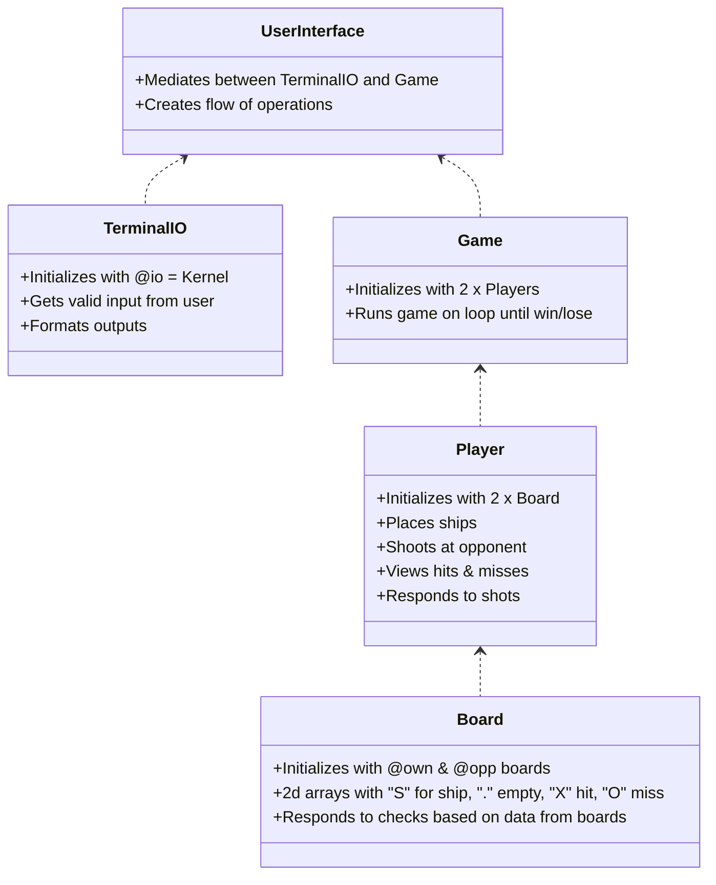

```mermaid
   classDiagram
   UserInterface <.. TerminalIO
   UserInterface <.. Game
   Game <.. Player
   Player <.. Board
   class Terminal IO{
   +Initializes with @io = Kernel
   +Gets valid input from user
   +Formats outputs
   }
   class UserInterface{
   +Mediates between TerminalIO and Game
   +Creates flow of operations
   }
   class Game{
   +Initializes with 2 x Players
   +Runs game on loop until win/lose
   }
   class Player {
   +Initializes with 2 x Board
   +Places ships
   +Shoots at opponent
   +Views hits & misses
   +Responds to shots
   }
   class Board {
   +Initializes with @own & @opp boards
   +2d arrays with "S" for ship, "." empty, "X" hit, "O" miss
   +Responds to checks based on data from boards
   }
```
             
