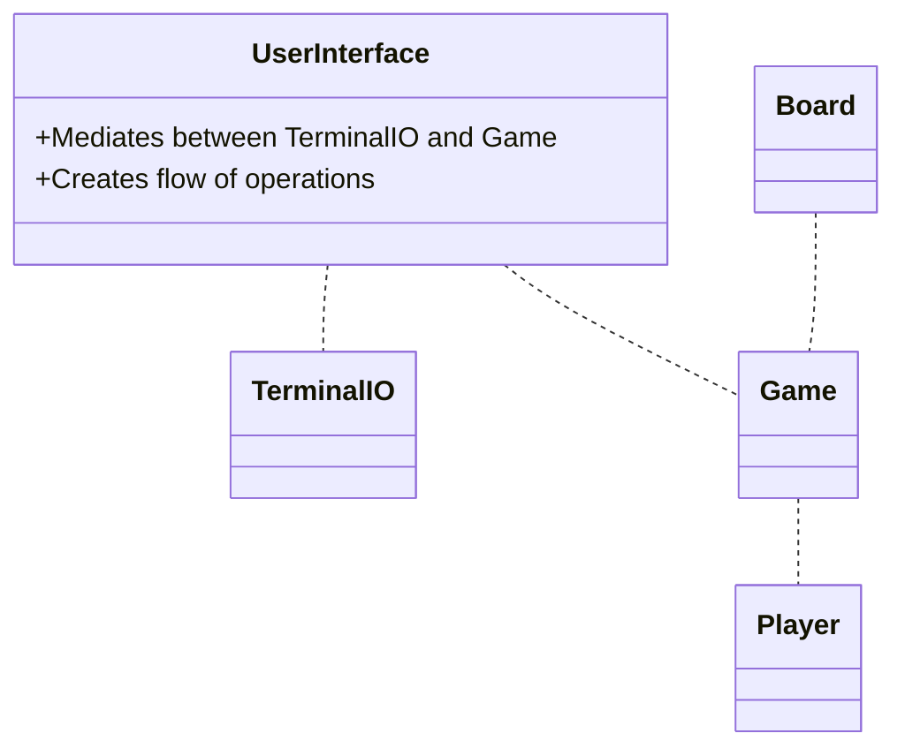

             
             +---------------------------------+
                  |   UserInterface                 |
                  |                                 |
                  |   Mediates between TerminalIO   |
                  |   and Game                      |
                  |                                 |
                  |       |
                  |                                 |
                  +------+------------------------+-+
                         |                        |
                         |                        |
+------------------------+---------+       +------+-----------------------------+
|   TerminalIO                     |       | Game                               |
|                                  |       |                                    |
|   Initializes with @io           |       | Initializes with 2 x Player        |
|   defaults to Kernel             |       |                                    |
|                                  |       | Runs game in loop until win/lose   |
|   Gets valid inputs from user    |       | Mediates between Players           |
|                                  |       |                                    |
|   Formats outputs                |       | The shot respose method in Player  |
|                                  |       | can return signifying loss         |
+----------------------------------+       +------------------------------------+
                                           |
             +-----------------------------+-+     +-------------------------------+
             |   Player                      |     | Board                         |
             |                               |     |                               |
             |   Initializes with 2 x Board  |     | Keeps ship data in @own       |
             |                               |     | Keeps hit/miss data in @opp   |
             |   Places ships                |     | "S" ship, "." empty, "X" hit  |
             |   Shoots at opponent          +-----+ "O" miss                      |
             |   Views hit & misses          |     |                               |
             |   Responds to shots           |     | Responds to checks based on   |
             |                               |     | data from board               |
             +-------------------------------+     +-------------------------------+
