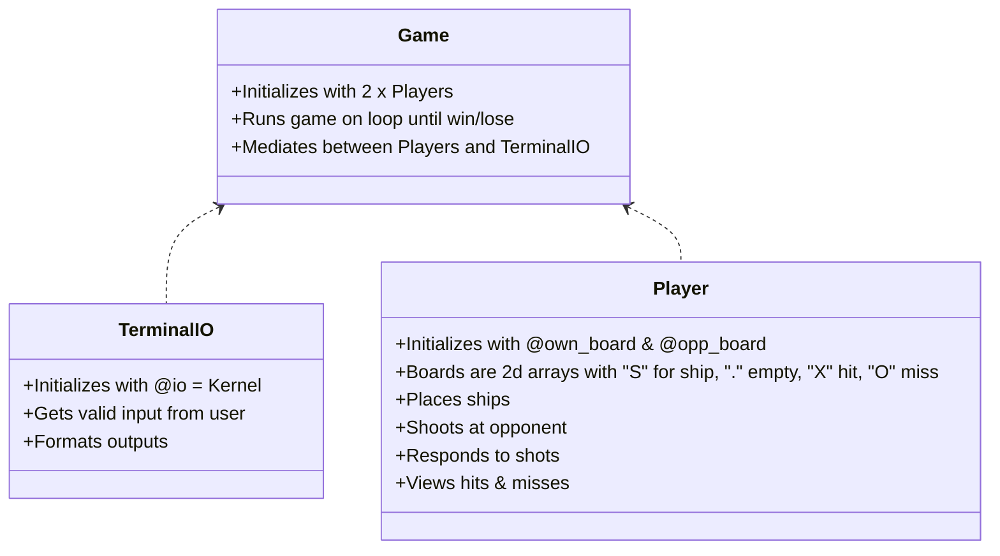

```mermaid
   classDiagram
   Game <.. TerminalIO
   Game <.. Player
   class Terminal IO{
   +Initializes with @io = Kernel
   +Gets valid input from user
   +Formats outputs
   }
   class Game{
   +Initializes with 2 x Players
   +Runs game on loop until win/lose
   +Mediates between Players and TerminalIO
   }
   class Player {
   +Initializes with @own_board & @opp_board
   +Boards are 2d arrays with "S" for ship, "." empty, "X" hit, "O" miss
   +Places ships 
   +Shoots at opponent
   +Responds to shots
   +Views hits & misses
   }
```
             
