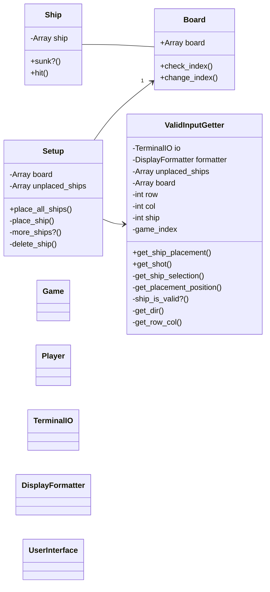

```mermaid
   classDiagram
   direction LR
   
   Ship -- Board
   Setup --> "1" Board
   Setup --> ValidInputGetter

   class Ship{
      -Array ship
      +sunk?()
      +hit()
   }

   class Board {
      +Array board
      +check_index() 
      +change_index()
   }

   class Setup {
      -Array board
      -Array unplaced_ships
      +place_all_ships()
      -place_ship()
      -more_ships?()
      -delete_ship()
   }

   class ValidInputGetter {
      -TerminalIO io
      -DisplayFormatter formatter
      -Array unplaced_ships
      -Array board
      -int row
      -int col
      -int ship
      +get_ship_placement()
      +get_shot()
      -get_ship_selection()
      -get_placement_position()
      -ship_is_valid?()
      -get_dir()
      -get_row_col()
      -game_index
   }

   class Game {
   
   }

   class Player {

   }

   class TerminalIO {

   }

   class DisplayFormatter {

   }

   class UserInterface {
      
   }

```
